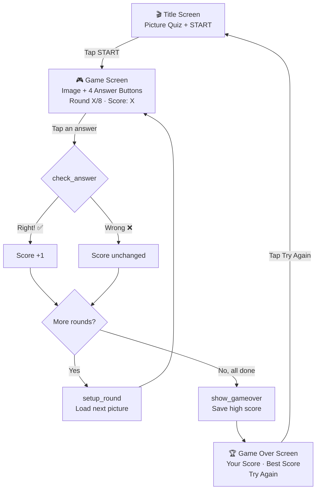
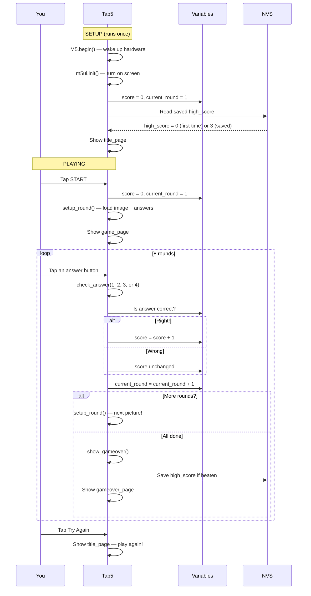

# Lesson: Picture Quiz — Build Your Own Quiz Game!

**Duration**: 60 minutes | **Age**: 9–13 | **Blocks**: ~29 total (~20 learning blocks, + `current_choices` variable) | **Concepts**: 7 (introduced gradually)

---

## 🎯 What You'll Build

You'll build your very own **picture quiz game** for the M5Stack Tab5! The game shows you a picture and asks you to pick the right answer from four choices. After 8 rounds, you'll see your final score — and the game *remembers* your best score forever, even if you turn the device off. Can you beat your own high score?

## 🧠 What You'll Learn

- **Variables**: Named boxes where your program stores numbers — like `score` and `current_round`. You can read them, change them, and compare them.
- **Lists**: Numbered shelves that hold lots of related things in order. Lists can even contain other lists — like a bookshelf (the outer list) where each shelf holds more books (the inner lists)!
- **Event Handling**: Code that waits for something to happen (like a button tap) and then springs into action — just like answering the door when the doorbell rings.
- **Conditional Logic (if/else)**: Your program makes decisions! "If the answer is right, add a point. Otherwise, don't."
- **Functions**: Reusable recipes. Write the steps once, then call the recipe whenever you need it — like a pizza recipe you can follow again and again.
- **Page Navigation**: Moving between different screens on your Tab5, like flipping pages in a book.
- **NVS (Persistent Storage)**: A special memory that survives turning the power off — like carving your high score into stone instead of writing it in sand.

---

⚠️ **Pedagogical Note**: This lesson introduces **7 new concepts**, which is above the ideal 2–3 for a one-hour session. However, the concepts are introduced one at a time across the build, and several (functions, events) build naturally on earlier ones (variables, lists). NVS is deliberately saved for last (Step 7) as a "bonus" concept — the quiz works perfectly without it, and NVS is introduced as the natural answer to "why does my high score disappear when I turn it off?" If students have *no* prior coding experience, consider splitting this into two sessions: Session 1 (pages + variables + lists + functions, ~40 min) and Session 2 (NVS + challenges, ~20 min).

💡 **Suggestion**: The trickiest part is understanding how a "list of lists" works. Before Step 3, draw a simple diagram on a whiteboard of a bookshelf with 8 shelves, each holding 4 books. Show how `get item (current_round) from all_answers` pulls out one shelf into `current_choices`, and then `get item 1 from current_choices` picks a book from that shelf. A 2-minute visual explanation saves 10 minutes of confusion.

---

## 📦 What You Need

- **M5Stack Tab5** controller
- USB cable to connect to your computer
- An flash storage with 8 quiz images pre-loaded (see the **Image Preparation** section below)
- No extra hardware needed!

### 🖼️ Image Preparation (Do This Before the Lesson!)

Before you start coding, you need 8 pictures uploaded to your device. Save them as `.jpg` files on the flash storage.

1. Find 8 images you want to quiz people about (landmarks, animals, people, planets — anything!)
2. Resize them to about 256×256 pixels
3. Upload them to your device at `/flash/res/img/`
4. Name them `Q1.jpg`, `Q2.jpg`, `Q3.jpg`, `Q4.jpg`, `Q5.jpg`, `Q6.jpg`, `Q7.jpg`, `Q8.jpg`

The program will load them from `Q1.jpg`, `Q2.jpg`, etc.

---

## 🗺️ How the Program Works

Your quiz game has three screens, just like three pages in a book. Here's the path your program follows:



> 💡 **What's a flowchart?** It's a map of your program. Follow the arrows to see where the program goes next — just like following a treasure map!

---

## 🏗️ Let's Build It!

### Step 1: Create Your Project and Design Three Screens

**What we're doing:** Every program needs a home. We'll create a new project, tell UIFlow2 we're using a Tab5, and build all three screens in the UI Editor — the title screen, the game screen, and the game-over screen.

> 🧩 **Analogy**: The UI Editor is like decorating three pages of a scrapbook. You drag stickers (widgets) onto each page and position them exactly where you want. The computer remembers the layout so you don't have to describe every pixel in code.

**Instructions:**

**A) Create the project:**
1. Go to https://uiflow2.m5stack.com/
2. Click **File → New Project** and name it "Picture Quiz"
3. In the right sidebar, set **Controller** to **Tab5** and **Connection** to **USB**


**B) Open the UI Editor:**
4. Click the **UI Editor** button in the bottom toolbar — it opens full-screen

**C) Build Page 0 — The Title Screen:**
5. Click page0's background in the Properties panel and set it to `0x1A237E` (dark blue)
6. Drag a **Label** onto the canvas. Set text to `Picture Quiz`, font to `lv.font_montserrat_48`, text color to `0xFFFFFF` (white), background opacity to `0`, position x=`200` y=`80`
7. Drag another **Label**. Set text to `Test your knowledge!`, font `lv.font_montserrat_18`, color `0xB0BEC5`, background opacity `0`, x=`280` y=`170`
8. Drag a **Button**. Set text to `START`, width `200` height `60`, color `0x4CAF50` (green), font `lv.font_montserrat_24`, x=`300` y=`300`
9. In the component list (left panel), rename `widget2` to `start_btn` and rename `page0` to `title_page`


**D) Build Page 1 — The Game Screen:**
10. Click the **▶ right arrow** in the page bar to add a new page. Rename it to `game_page` and set its background to `0xECEFF1` (light gray)
11. Drag an **Image** widget. Set source to `Q1.jpg`, position x=`30` y=`112`. Rename it to `quiz_image`
12. Drag a **Label**. Set text `Round 1/8`, font `lv.font_montserrat_18`, color `0x37474F`, background opacity `0`, x=`600` y=`200`. Rename to `round_label`
13. Drag a **Label**. Set text `Score: 0`, font `lv.font_montserrat_18`, color `0x37474F`, background opacity `0`, x=`1100` y=`200`. Rename to `score_label`
14. Drag four **Button** widgets in a 2×2 grid on the right side:
    - **answer_btn1**: text `Answer 1`, w`210` h`55`, color `0x2196F3`, font `lv.font_montserrat_16`, x=`400` y=`150`
    - **answer_btn2**: text `Answer 2`, w`210` h`55`, color `0x2196F3`, font `lv.font_montserrat_16`, x=`800` y=`150`
    - **answer_btn3**: text `Answer 3`, w`210` h`55`, color `0x2196F3`, font `lv.font_montserrat_16`, x=`400` y=`300`
    - **answer_btn4**: text `Answer 4`, w`210` h`55`, color `0x2196F3`, font `lv.font_montserrat_16`, x=`800` y=`300`


**E) Build Page 2 — The Game Over Screen:**
15. Click **▶** to add page2. Rename to `gameover_page`, background `0x1A237E`
16. Drag a **Label**: text `Game Over!`, font `lv.font_montserrat_48`, color `0xFFEB3B` (yellow), background opacity `0`, x=`460` y=`60`
17. Drag a **Label**: text `Your Score: 0/8`, font `lv.font_montserrat_24`, color `0xFFFFFF`, background opacity `0`, x=`520` y=`240`. Rename to `final_score_label`
18. Drag a **Label**: text `Best Score: 0/8`, font `lv.font_montserrat_24`, color `0xB0BEC5`, background opacity `0`, x=`520` y=`380`. Rename to `best_score_label`
19. Drag a **Button**: text `Try Again`, w`200` h`60`, color `0xFF9800` (orange), font `lv.font_montserrat_24`, x=`540` y=`560`. Rename to `try_again_btn`
20. **Close the UI Editor** — your widgets appear as blocks in the workspace!


Your workspace should now show: `M5.begin()`, `Widgets.setRotation()`, `m5ui.init()`, three `M5Page()` blocks full of widgets, and a `title_page screen_load` block in Setup. The Loop section has `M5.update()`.

---

### Step 2: Give Your Game a Memory — Variables and Lists

**What we're doing:** Now we create the "brain" of our quiz. Variables store single pieces of information (like your score). Lists store whole collections (like all the image paths and all the answer choices).

> 🧩 **Analogy**: A variable is like a **labelled jar** — you write `score` on the label, and whatever number is inside the jar is your current score. A list is like a **numbered shelf**. And a list-of-lists? That's a whole **bookshelf** — each shelf holds another row of items!

**Instructions:**

**A) Create three variables:**
1. Open the **Variables** category in the toolbox
2. Click **Create variable...** → name it `score`
3. Drag **set score to 0** into the **Setup** section (after `m5ui.init()`)
4. Repeat: create `current_round`, drag **set current_round to 1** into Setup
5. Repeat: create `high_score`, drag **set high_score to 0** into Setup

**B) Create the images list:**
6. From the **Variables** category, click **Create variable...** and name it `images`
7. From **Variables**, drag a **set images to** block into the Setup section
8. From **Lists**, drag a **create list with** block and connect it to the **set images to** block
9. Click the gear ⚙ on the **create list with** block, add slots until you have 8, and fill them:
   - `"Q1.jpg"` — Axolotl
   - `"Q2.jpg"` — Saturn
   - `"Q3.jpg"` — Statue of Liberty
   - `"Q4.jpg"` — Theodore Roosevelt
   - `"Q5.jpg"` — Jamaica
   - `"Q6.jpg"` — Jackson 5
   - `"Q7.jpg"` — Chanel
   - `"Q8.jpg"` — Hyacinth

**C) Create the all_answers list (a list of lists!):**
10. From the **Variables** category, click **Create variable...** and name it `all_answers`
11. From **Variables**, drag a **set all_answers to** block into the Setup section
12. From **Lists**, drag a **create list with** block and connect it to the **set all_answers to** block
13. Click the gear ⚙ on the **create list with** block to add **8 slots** (one per round).
14. Inside **each slot**, drag another **create list with** block with 4 text items. Fill them like this:
   - Slot 1 (Round 1 — Axolotl): `["Olm", "Newt", "Frog", "Axolotl"]`
   - Slot 2 (Round 2 — Saturn): `["Mars", "Venus", "Jupiter", "Saturn"]`
   - Slot 3 (Round 3 — Statue of Liberty): `["Statue of Liberty", "Tower of Pisa", "Big Ben", "Eiffel Tower"]`
   - Slot 4 (Round 4 — Theodore Roosevelt): `["Woodrow Wilson", "Theodore Roosevelt", "Herbert Hoover", "Franklin D. Roosevelt"]`
   - Slot 5 (Round 5 — Jamaica): `["Haiti", "Puerto Rico", "Jamaica", "Dominican Republic"]`
   - Slot 6 (Round 6 — Jackson 5): `["The Sylvers", "Jackson 5", "Earth, Wind & Fire", "The Osmonds"]`
   - Slot 7 (Round 7 — Chanel): `["Chanel", "Comcast", "Channel 4", "Coca-Cola"]`
   - Slot 8 (Round 8 — Hyacinth): `["Rose", "Tulip", "Orchid", "Hyacinth"]`

> 💡 **What's a list of lists?** It's like a **bookshelf**! The outer list (`all_answers`) is the whole bookshelf with 8 shelves. Each shelf holds another list of 4 books (the answers for one round). To get the answers for round 3, you pull out shelf 3, then pick the book you want. No tricky multiplication maths — just two simple lookups!

**D) Create the correct_index list:**
15. From the **Variables** category, click **Create variable...** and name it `correct_index`
16. From **Variables**, drag a **set correct_index to** block into the Setup section
17. From **Lists**, drag a **create list with** block and connect it to the **set correct_index to** block
18. Click the gear ⚙ on the **create list with** block to add **8 number slots**:
   - Slot 1: `4` (Axolotl = answer #4, index 4)
   - Slot 2: `4` (Saturn = answer #4, index 4)
   - Slot 3: `1` (Statue of Liberty = answer #1, index 1)
   - Slot 4: `2` (Theodore Roosevelt = answer #2, index 2)
   - Slot 5: `3` (Jamaica = answer #3, index 3)
   - Slot 6: `2` (Jackson 5 = answer #2, index 2)
   - Slot 7: `1` (Chanel = answer #1, index 1)
   - Slot 8: `4` (Hyacinth = answer #4, index 4)

> 💡 **What's an index?** In UIFlow2, lists start counting at 1 — so the first item is index 1, the second is index 2, the third is index 3, and the fourth is index 4. The `correct_index` list stores which answer is right for each round using these index numbers.

---

ℹ️ **Teaching Tip — List of Lists Visual**

Here's how `all_answers` is organized as a bookshelf. Each shelf holds the 4 answers for one round:

```
┌──────────────────────────────────────────────────────────────┐
│  all_answers (the bookshelf — 8 shelves)                     │
│                                                              │
│  Shelf [1]:  ["Olm", "Newt", "Frog", "Axolotl"]       ← R1 │
│  Shelf [2]:  ["Mars", "Venus", "Jupiter", "Saturn"]    ← R2 │
│  Shelf [3]:  ["Statue of Liberty", "Tower of Pisa",     ← R3 │
│               "Big Ben", "Eiffel Tower"]                     │
│  Shelf [4]:  ["Woodrow Wilson", "Theodore Roosevelt",   ← R4 │
│               "Herbert Hoover", "Franklin D. Roosevelt"]     │
│  Shelf [5]:  ["Haiti", "Puerto Rico", "Jamaica",        ← R5 │
│               "Dominican Republic"]                          │
│  Shelf [6]:  ["The Sylvers", "Jackson 5",                ← R6 │
│               "Earth, Wind & Fire", "The Osmonds"]           │
│  Shelf [7]:  ["Chanel", "Comcast", "Channel 4",          ← R7 │
│               "Coca-Cola"]                                   │
│  Shelf [8]:  ["Rose", "Tulip", "Orchid", "Hyacinth"]    ← R8 │
└──────────────────────────────────────────────────────────────┘
```

When `current_round` is 3, we grab shelf 3 from `all_answers`. Inside shelf 3: book 1 = "Statue of Liberty", book 2 = "Tower of Pisa", book 3 = "Big Ben", book 4 = "Eiffel Tower". Two simple steps — grab the shelf, then pick your book!

---

### Step 3: Write the Round Machine — `setup_round()`

**What we're doing:** A function is like a recipe. We write it once, then "call" it whenever we need a fresh round. This function loads the right picture, fills the four answer buttons with text, and updates the round counter.

> 🧩 **Analogy**: Think of `setup_round()` as a **vending machine**. You press the button (call the function), and it drops out a perfectly set-up round — correct image, correct answers, correct labels. No matter which round you're on, it always delivers the right thing.

**Instructions:**
1. Open **Functions** in the toolbox
2. Drag a **define function** block into Setup (after your lists). Name it `setup_round`. No parameters needed.

Inside the function body, add these blocks:

**a) Set the image:**
3. From **M5UI**, find **Set [quiz_image] local image** (auto-generated when you closed the UI Editor)
4. For the source value, use **Lists → in list [images] get # [current_round]**. Drag the `images` variable from **Variables** into the list slot, and `current_round` from **Variables** into the index slot.

**b) Get the answers for this round:**
5. First, we need a new variable to hold the 4 answers for the current round. Create a variable called `current_choices`.
6. Drag **set current_choices to** into the function body (before setting the button texts).
7. Set it to: **Lists → in list [all_answers] get # [current_round]**
   - This grabs the whole sub-list for this round from the bookshelf!

**c) Set answer button 1:**
8. Find **Set [answer_btn1] text to** from M5UI
9. For the text: **Lists → in list [current_choices] get # [1]**

**d) Set answer button 2:**
10. Same as above: **Lists → in list [current_choices] get # [2]**

**e) Set answer button 3:**
11. Same: **Lists → in list [current_choices] get # [3]**

**f) Set answer button 4:**
12. Same: **Lists → in list [current_choices] get # [4]**

**g) Update the round label:**
13. Find **Set [round_label] text to** from M5UI
14. UIFlow2 has no "join" block — use nested **Text → [] + []** blocks:
    -     - Inner `[] + []`: `[current_round]` + `["/8"]` (a Text block)
    - Outer `[] + []`: `["Round: "]` + (the inner `[] + []` result)

> 📋 **Complete Function — Here's What setup_round() Should Look Like:**
>
> ```
> define setup_round()
> │
> ├─ Set [quiz_image] local image → in list [images] get # [current_round]
> │
> ├─ set [current_choices] to → in list [all_answers] get # [current_round]
> │
> ├─ Set [answer_btn1] text to → in list [current_choices] get # [1]
> ├─ Set [answer_btn2] text to → in list [current_choices] get # [2]
> ├─ Set [answer_btn3] text to → in list [current_choices] get # [3]
> ├─ Set [answer_btn4] text to → in list [current_choices] get # [4]
> │
> └─ Set [round_label] text to → ["Round: "] + (current_round + ["/8"])
> ```

---

### Step 4: Write the Judge — `check_answer(answer_index)`

**What we're doing:** This is the brain of the quiz! Every time a player taps an answer, this function checks if they're right, updates the score, and decides whether to show the next round or end the game.

> 🧩 **Analogy**: `check_answer` is like a **quiz show host**. They hear your answer, check the answer card, say "Correct!" or "Wrong!", update your score, and move to the next question — or announce the final results.

**Instructions:**
1. Drag a **define function** block from **Functions**. Name it `check_answer`
2. Click the gear ⚙ and add one **input parameter** named `answer_index`. Return type: none.

Inside the function:

**a) Check if the answer is right:**
3. From **Logic**, drag an **if do** block
4. Condition: **Math → `=` (equals)**. Left = `answer_index`, Right = **Lists → in list [correct_index] get # [current_round]**

**b) If correct — add a point:**
5. Inside the if: **Variables → set score to `score + 1`** (use Math `+`)
6. Then update the display: **Set [score_label] text to** `"Score: "` + `score`
   - Use **Text → [] + []**: `["Score: "]` + `[score]`

**c) Advance to the next round:**
7. After the if block (not inside it!): **Variables → set current_round to `current_round + 1`** (use Math → `+`)

**d) Decide what happens next:**
8. From **Logic**, drag an **if else** block
9. Condition: **Math → `≤`** — `current_round <= 8`
10. **If true** (more rounds): **Functions → call `setup_round`**
11. **Else** (all done): **Functions → call `show_gameover`** (we'll make this next!)
> 📋 **Complete Function — Here's What check_answer() Should Look Like:**
>
> ```
> define check_answer(answer_index)
> │
> ├─ if [answer_index = in list correct_index get # current_round] do
> │     ├─ set [score] to [score + 1]
> │     └─ Set [score_label] text to → ["Score: "] + score
> │
> ├─ set [current_round] to [current_round + 1]
> │
> └─ if [current_round ≤ 8] do ... else
>       ├─ do: call setup_round()
>       └─ else: call show_gameover()
> ```
---

### Step 5: Write the Grand Finale — `show_gameover()`

**What we're doing:** When all 8 rounds are finished, this function shows the final results and checks if the player beat the high score.

> 🧩 **Analogy**: This is the **award ceremony** at the end of a tournament. It announces your score, checks if you broke a record, and updates the hall of fame.

**Instructions:**
1. Drag a **define function** block. Name it `show_gameover`. No parameters.

Inside the function:

**a) Show the final score:**
2. Find the **Set [final_score_label] text to** block (from M5UI)
   - UIFlow2 has no "join" block — use nested **Text → [] + []** blocks:
   - Inner `[] + []`: `[score]` + `["/8"]`
   - Outer `[] + []`: `["Your Score: "]` + (inner result)

**b) Check for a new high score:**
3. From **Logic**, drag an **if do** block
4. Condition: **Math → `>`** — `score > high_score`
5. Inside: 
   - **Variables → set high_score to `score`**
   - **System → NVS → nvs set integer**, key = `"high_score"`, value = `high_score`

> 💡 **What's this NVS block?** You're saving the high score to permanent memory! We'll set up the full NVS system in Step 7 — for now, just add the block as shown.

**c) Update the best score display:**
6. Find the **Set [best_score_label] text to** block (from M5UI)
   - Use the same nested `[] + []` pattern: `["Best Score: "]` + `([high_score]` + `["/8"])`

**d) Show the game-over screen:**
7. From **M5UI**, drag **gameover_page screen_load**
> 📋 **Complete Function — Here's What show_gameover() Should Look Like:**
>
> ```
> define show_gameover()
> │
> ├─ Set [final_score_label] text to → ["Your Score: "] + score + ["/8"]
> │
> ├─ if [score > high_score] do
> │     ├─ set [high_score] to [score]
> │     └─ nvs set integer "high_score" [high_score]
> │
> ├─ Set [best_score_label] text to → ["Best Score: "] + high_score + ["/8"]
> │
> └─ gameover_page screen_load
> ```
---

### Step 6: Wire Up the Buttons and Play!

**What we're doing:** We connect every button to the right function so that tapping them actually does something. Then we run the program and play our quiz!

> 🧩 **Analogy**: You've built a circuit with light bulbs and switches — now you connect the wires so flipping each switch turns on the right light.

**Instructions:**

**A) Start button:**
1. Find the CLICKED event handler block for `start_btn` (it's in the M5UI section)
2. Inside the handler, add these blocks in order:
   - **Variables → set score to `0`**
   - **Variables → set current_round to `1`**
   - **Functions → call `setup_round`**
   - **M5UI → game_page screen_load**

**B) Four answer buttons:**
3. Find the CLICKED handler for `answer_btn1`. Inside: **Functions → call `check_answer`** with argument `0`
4. `answer_btn2` handler: call `check_answer` with argument `1`
5. `answer_btn3` handler: call `check_answer` with argument `2`
6. `answer_btn4` handler: call `check_answer` with argument `3`

> 💡 **Why four separate handlers?** Each button calls the same function but passes a different number (0, 1, 2, or 3). That's how `check_answer` knows *which* button was pressed!

**C) Try Again button:**
7. Find the CLICKED handler for `try_again_btn`. Inside: **M5UI → title_page screen_load**

**D) Final checks:**
8. In the **Loop** section, make sure `M5.update()` is there — it keeps the touch screen alive!
9. At the end of **Setup**, make sure **title_page screen_load** is present — it shows the start screen first.

**E) Run it!**
10. Click the **Run Once** button at the bottom
11. Watch your Tab5 — you should see the title screen. Tap START, answer 8 questions, see your score!

🎉 **Congratulations!** You built a complete quiz game with pictures, scoring, and high score tracking. That's real programming!

---

### Step 7: Make Your High Score Stick! — NVS

**What we're doing:** You've built a working quiz — awesome! But there's one problem: when you turn the Tab5 off, the high score disappears. We can fix this with something called **NVS** (Non-Volatile Storage). It's a special memory that survives power-offs!

> 🧩 **Analogy**: Regular variables are like writing on a whiteboard — erase the power and it's gone. NVS is like **carving your score into stone** — it stays there until you deliberately change it.

**Instructions:**

**A) Load the saved high score on startup:**
1. Open **System → NVS** in the toolbox
2. In **Setup**, find your `set high_score to 0` block
3. Drag **nvs get integer** into Setup
4. Set the key to `"high_score"`
5. Replace the `0` in `set high_score to 0` with the `nvs.getInt("high_score")` block

Your Setup now reads: `set high_score to nvs.getInt("high_score")`

> 💡 **Magic!** The first time you run the program, no high score exists yet. `nvs.getInt` is smart — when a key doesn't exist, it just returns `0`. So the high score starts at 0 and only goes up from there!

**B) You already set up the saving part!**
Remember the `nvs set integer` block you added inside `show_gameover()` back in Step 5? That's the other half of NVS — it **saves** the high score when someone beats it. Together, `nvs.getInt` (read on startup) and `nvs.setInt` (save when beaten) make your high score last forever!

6. Run your program, play a full game, and beat your own high score. Then turn the Tab5 off and on again — the best score is still there! 🎉

---

## 🔍 What's Happening? (Deep Dive)

Let's trace through your entire program, step by step, so you understand exactly what each block does:



**In plain English:**

1. **Setup**: The Tab5 wakes up, the screen turns on, score = 0, current_round = 1, high_score = 0. The title screen appears.
2. **START tapped**: Score resets to 0, round resets to 1. `setup_round()` loads the first picture and fills the four buttons with the right answers. The game screen appears.
3. **Answer tapped**: The button calls `check_answer()` with a number (1–4). The function compares your answer to `correct_index[current_round]`. If they match, score goes up. The round counter advances. If there are more rounds, `setup_round()` loads the next set. If not, `show_gameover()` runs.
4. **Game over**: Your final score displays. If you beat the high score, it's saved to NVS — forever! The game-over screen appears.
5. **Try Again**: Back to the title screen. The high score is still there, waiting to be beaten.
6. **Loop**: `M5.update()` runs over and over in the background, keeping the touch screen responsive.

---

## 🎮 Try This! (Challenges)

> 💡 These challenges are optional — try them if you finish early!

1. **Easy — Change the Look**: Change the background color of `title_page` from dark blue (`0x1A237E`) to your favourite colour. Try `0x4A148C` (purple) or `0x004D40` (teal).

2. **Easy — Different Questions**: Replace the quiz content with your own theme! Change the image paths and answers in the three lists. Try a "Flags of the World" quiz or "Guess the Animal" quiz.

3. **Medium — Even More Rounds**: Add 2 more rounds (total of 10). You'll need to: add 2 more image paths to `images`, add 8 more answer slots to `all_answers` (10 rounds × 4 = 40 total), add 2 more correct indices to `correct_index`, and change the `<= 8` in `check_answer` to `<= 10`.

4. **Medium — Sound Effects**: If you have a speaker, add a happy "ding" for correct answers and a sad "buzz" for wrong ones. Use the **Speaker** hardware block inside `check_answer`'s if/else.

5. **Hard — Colour Feedback**: After tapping an answer, briefly flash the button green (if correct) or red (if wrong) before moving to the next round. You'll need to use **set_style_bg_color** blocks and a short delay from **System → Time**.

6. **Hard — Countdown Timer**: Give the player only 10 seconds per round. Use a timer variable and check it in the Loop section. If time runs out, auto-advance to the next round with no points.

---

## 🐛 Something Not Working?

| Problem | Try This |
|---------|----------|
| Blank screen | Check all widgets have `parent=page`. In the UI Editor, make sure each widget is inside the correct page. |
| START button does nothing | Check the CLICKED event handler for `start_btn` is attached and contains the four blocks (reset variables, call setup_round, screen_load). |
| Answer buttons don't respond | Make sure all four answer button event handlers are wired up and call `check_answer` with the correct number (0, 1, 2, 3). |
| Wrong image shows | Check the `images` list — make sure each path matches the actual file names on your flash storage (capitalisation matters!). |
| Image doesn't appear at all | Are the `.jpg` files uploaded to `/flash/res/img/`? Check the path is exactly `Q1.jpg`. |
| Score doesn't change | Check the `if` condition inside `check_answer` — is `answer_index = correct_index[current_round]` wired correctly? |
| High score resets every time | Make sure `nvs.setInt("high_score", high_score)` is inside the `if score > high_score` block in `show_gameover`. |
| Game doesn't advance past round 1 | Check that `current_round` is being incremented (`set current_round to current_round + 1`) and that the `<= 8` comparison in `if else` is correct. |
| Buttons show wrong text | Check that `current_choices` is set to `get item (current_round) from all_answers`. Then make sure each button gets the right index from `current_choices` (1, 2, 3, or 4). |

---

## 📝 Lesson Review (for teachers/parents)

- **Concepts taught**: Variables, Lists, Event Handling, Conditional Logic (if/else), Functions, Page Navigation, NVS (persistent storage)
- **Prior knowledge needed**: None — this can be a first programming lesson, though familiarity with the UIFlow2 interface (opening the toolbox, dragging blocks) helps.
- **Common sticking points**:
  - **Understanding list of lists**: The nested list structure (bookshelf analogy) can be confusing at first. Use the visual diagram in Step 2 to explain it before students start Step 3. Emphasize: first grab the shelf into `current_choices`, then pick a book from it.
  - **Forgetting to wire all four answer buttons**: Students often wire buttons 1 and 2, then skip 3 and 4. Remind them: all four need handlers!
  - **Parameter passing**: Understanding that `check_answer(1)` sends `1` to the `answer_index` parameter is a new concept for many. Walk through one example together.
  - **Function order**: Students sometimes put code after a function call expecting it to run — but functions run their code *immediately* when called.
- **Extension ideas**: After this lesson, students can build a "Who Wants to Be a Millionaire?" style quiz with lifelines, a team-score tracker for classroom competitions, or a flashcard study tool using the same page/function patterns.
