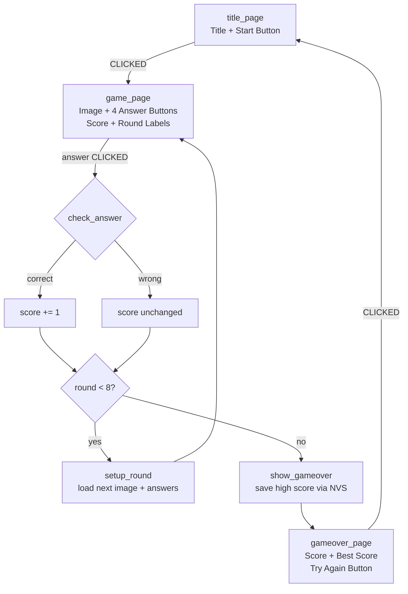
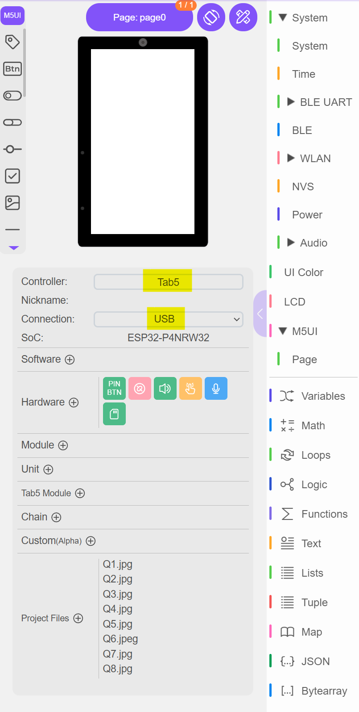
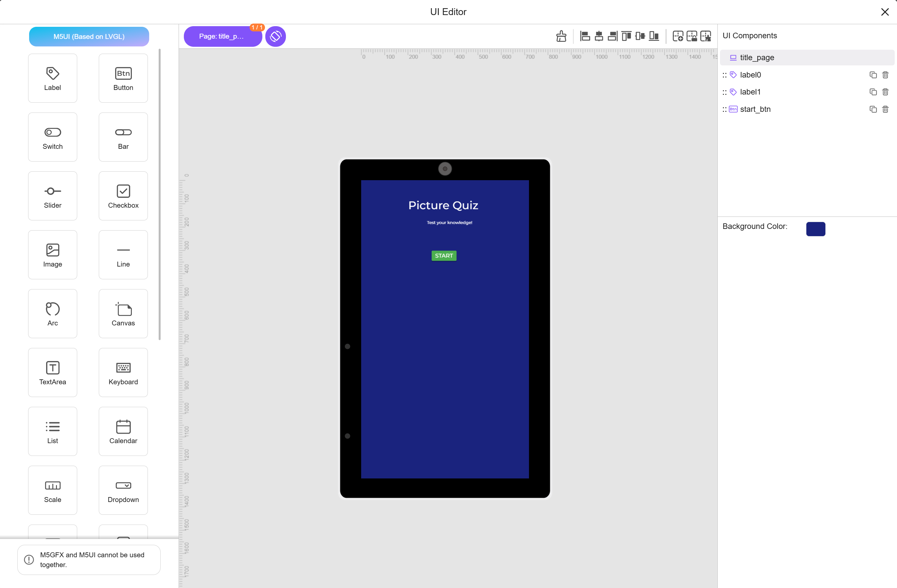
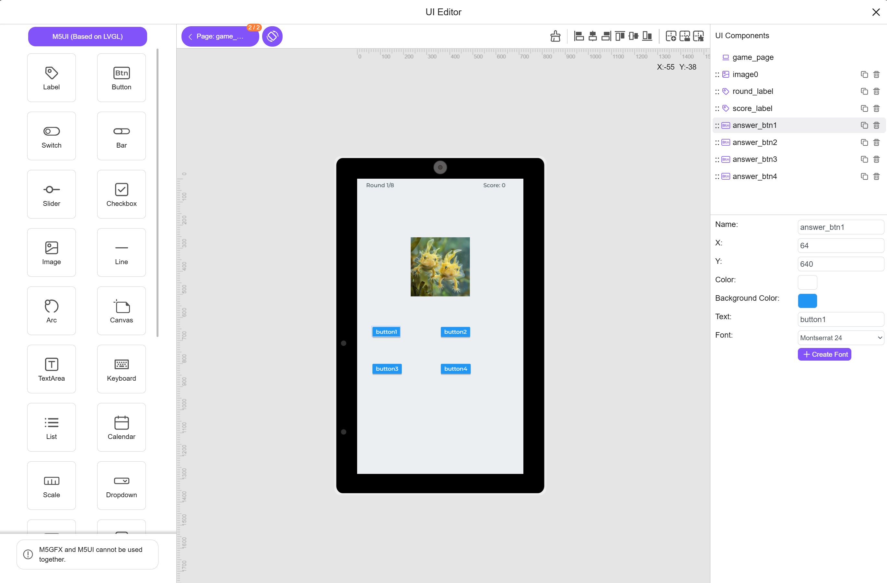
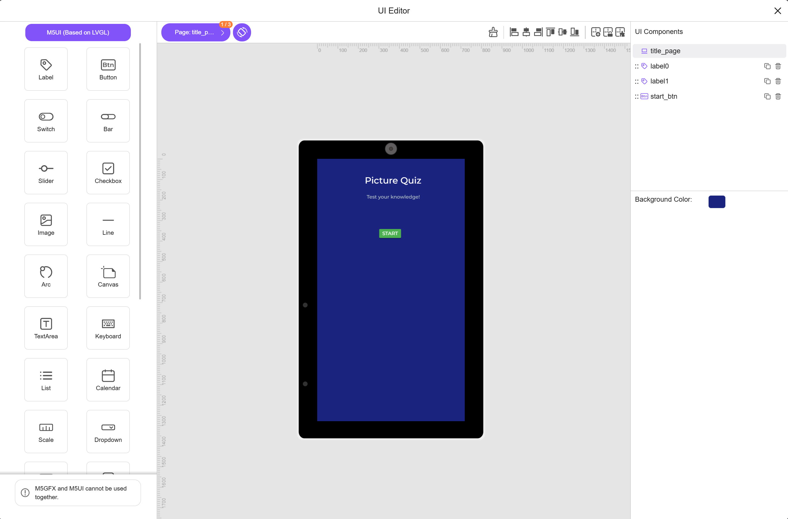

## Program: Picture Quiz

### What We're Building
A multi-round picture quiz game for the M5Stack Tab5! The player sees a picture and picks the correct answer from four choices. After 8 rounds, their final score is shown and saved as a high score using non-volatile storage (NVS). The player can then try again to beat their best score. Three screens guide the player: a start screen, the quiz gameplay, and a game-over screen with the leaderboard.

### Concepts Covered
- **Variables** — tracking score, current round, and high score
- **Lists** — storing image paths, answer choices, and correct answer indices
- **Event Handling** — responding to button clicks (CLICKED event)
- **Conditional Logic** — `if/else` to check answers and determine game-over
- **Functions** — organizing code into reusable blocks (`setup_round`, `check_answer`, `show_gameover`)
- **Page Navigation** — switching between three screens with `screen_load()`
- **NVS (Non-Volatile Storage)** — saving and loading a persistent high score

### Prerequisites
- Controller: **Tab5** (ESP32-P4NRW32, 800×480 landscape)
- Connection: **USB**
- Images: 8 quiz images pre-loaded as 256×256 `.jpg` files on the device flash at `/flash/res/img/`
- flash storage mounted and accessible at `/sd/`

---

### Design Discussion: Why 8 Rounds Instead of 20?

The original spec asks for 20 rounds with 4 answer buttons each. Here's why that's infeasible within the 15–25 block guideline:

| Data Item | 20 Rounds | 8 Rounds |
|-----------|-----------|----------|
| Image paths in list | 20 items | 8 items |
| Answer strings in list | 80 items (flat) | 8 sub-lists of 4 (list of lists) |
| Correct answer indices | 20 items | 8 items |
| **Total list entries** | **120** | **48** |

Even at one block per list item, 20 rounds would need ~120 data blocks *before* any game logic. That's overwhelming for a student aged 9–13.

**8 rounds teaches exactly the same concepts** — lists, variables, event handling, conditional logic, functions, pages, and NVS — while keeping the program at a manageable ~25 blocks. Once students understand the pattern, scaling to more rounds is a natural extension (just add more items to the lists).

---

### Program Architecture

---

### Step-by-Step Build

#### Step 1: Create a New Project and Configure Hardware

**Why?** Every UIFlow2 program starts with a blank project. We need to tell UIFlow2 which controller we're using and how it's connected.

**How?**
1. Go to https://uiflow2.m5stack.com/
2. Click **File → New Project**
3. Name the project "Picture Quiz" in the project name field at the top
4. In the right sidebar, under **Controller**, select **Tab5**
5. Under **Connection**, select **USB**
6. Verify the SoC shows "ESP32-P4NRW32"

---

#### Step 2: Open the UI Editor and Design Page 0 — The Start Screen

**Why?** The start screen welcomes the player and gives them a big friendly button to begin the quiz. We use the UI Editor to position widgets visually — it's like arranging stickers on a page.

**How?**
1. Click the **UI Editor** button in the bottom toolbar (it opens full-screen)
2. You should see **page0** on the canvas. If not, it's the default page.
3. In the right **Properties** panel, click the page background color and set it to dark blue: `0x1A237E`

**Add the Title Label:**
4. Drag a **Label** widget from the left toolbox onto the canvas
5. Select it, then in the Properties panel set:
   - Text: `Picture Quiz`
   - Font: `lv.font_montserrat_48`
   - Text Color: `0xFFFFFF` (white)
   - Background Opacity: `0` (transparent)
   - Position: x=`200`, y=`80`

**Add the Subtitle Label:**
6. Drag another **Label** widget onto the canvas
7. Set its properties:
   - Text: `Test your knowledge!`
   - Font: `lv.font_montserrat_18`
   - Text Color: `0xB0BEC5` (light blue-gray)
   - Background Opacity: `0`
   - Position: x=`280`, y=`170`

**Add the Start Button:**
8. Drag a **Button** widget onto the canvas
9. Set its properties:
   - Text: `START`
   - Width: `200`, Height: `60`
   - Background Color: `0x4CAF50` (green)
   - Text Color: `0xFFFFFF` (white)
   - Font: `lv.font_montserrat_24`
   - Position: x=`300`, y=`300`
10. Rename the button in the component list from `widget2` to `start_btn` (double-click the name)

**Rename the page:**
11. In the component list, rename `page0` to `title_page`

---

#### Step 3: Add Page 1 — The Game Screen

**Why?** This is where the quiz happens! We need a spot for the picture, four answer buttons, and labels to show the current round and score.

**How?**
1. In the UI Editor, click the **right arrow (▶)** in the page navigation bar to add a new page. It will be named `page1`.
2. Rename it to `game_page`
3. Set its background color to `0xECEFF1` (light gray)

**Add the Image Widget:**
4. Drag an **Image** widget onto the canvas
5. Set its properties:
   - Source: `Q1.jpg` (placeholder — we'll change this in code)
   - Position: x=`30`, y=`112`
   - The image will display at its native 256×256 size
6. Rename it to `quiz_image`

**Add the Round Label:**
7. Drag a **Label** widget to the top-center
8. Set properties:
   - Text: `Round 1/8`
   - Font: `lv.font_montserrat_18`
   - Text Color: `0x37474F`
   - Background Opacity: `0`
   - Position: x=`600`, y=`200`
9. Rename it to `round_label`

**Add the Score Label:**
10. Drag a **Label** widget to the top-right
11. Set properties:
    - Text: `Score: 0`
    - Font: `lv.font_montserrat_18`
    - Text Color: `0x37474F`
    - Background Opacity: `0`
    - Position: x=`1100`, y=`200`
12. Rename it to `score_label`

**Add the Four Answer Buttons (2×2 grid on the right side):**
13. Drag a **Button** widget. Set:
    - Text: `Answer 1`
    - Width: `210`, Height: `55`
    - Background Color: `0x2196F3` (blue)
    - Text Color: `0xFFFFFF`
    - Font: `lv.font_montserrat_16`
    - Position: x=`400`, y=`150`
    - Rename to `answer_btn1`

14. Drag a second Button. Set:
    - Text: `Answer 2`
    - Width: `210`, Height: `55`
    - Background Color: `0x2196F3`
    - Text Color: `0xFFFFFF`
    - Font: `lv.font_montserrat_16`
    - Position: x=`800`, y=`150`
    - Rename to `answer_btn2`

15. Drag a third Button. Set:
    - Text: `Answer 3`
    - Width: `210`, Height: `55`
    - Background Color: `0x2196F3`
    - Text Color: `0xFFFFFF`
    - Font: `lv.font_montserrat_16`
    - Position: x=`400`, y=`300`
    - Rename to `answer_btn3`

16. Drag a fourth Button. Set:
    - Text: `Answer 4`
    - Width: `210`, Height: `55`
    - Background Color: `0x2196F3`
    - Text Color: `0xFFFFFF`
    - Font: `lv.font_montserrat_16`
    - Position: x=`800`, y=`300`
    - Rename to `answer_btn4`

---

#### Step 4: Add Page 2 — The Game Over Screen

**Why?** After all 8 rounds, we need to tell the player their score, show the best score ever achieved, and let them try again.

**How?**
1. Click the **right arrow (▶)** to add page2. Rename it to `gameover_page`
2. Set background color to `0x1A237E` (dark blue, matching the start screen)

**Add Game Over Title:**
3. Drag a **Label**. Set:
   - Text: `Game Over!`
   - Font: `lv.font_montserrat_48`
   - Text Color: `0xFFEB3B` (yellow)
   - Background Opacity: `0`
   - Position: x=`460`, y=`60`

**Add Your Score Label:**
4. Drag a **Label**. Set:
   - Text: `Your Score: 0/8`
   - Font: `lv.font_montserrat_24`
   - Text Color: `0xFFFFFF`
   - Background Opacity: `0`
   - Position: x=`520`, y=`240`
   - Rename to `final_score_label`

**Add Best Score Label:**
5. Drag a **Label**. Set:
   - Text: `Best Score: 0/8`
   - Font: `lv.font_montserrat_24`
   - Text Color: `0xB0BEC5`
   - Background Opacity: `0`
   - Position: x=`520`, y=`380`
   - Rename to `best_score_label`

**Add Try Again Button:**
6. Drag a **Button**. Set:
   - Text: `Try Again`
   - Width: `200`, Height: `60`
   - Background Color: `0xFF9800` (orange)
   - Text Color: `0xFFFFFF`
   - Font: `lv.font_montserrat_24`
   - Position: x=`540`, y=`560`
   - Rename to `try_again_btn`

7. **Close the UI Editor** by clicking the X button. Your widgets are now created as blocks in the workspace!

---

#### Step 5: Create the Game Variables

**Why?** Variables are the program's "memory." We need three: one to track the player's score, one to know which round we're on, and one to remember the all-time best score.

**How?**
1. In the block toolbox, open the **Variables** category
2. Click **Create variable...** and name it `score`
3. Drag the **set score to 0** block into the **Setup** section (near the top, after `m5ui.init()`)
4. Create another variable named `current_round`
5. Drag **set current_round to 1** into Setup, right after the score block
6. Create a third variable named `high_score`
7. Drag **set high_score to 0** into Setup (we'll update this from NVS later)

---

#### Step 6: Create the Question Data Lists

**Why?** Lists let us store all our quiz data in an organized way. We use three lists:
- `images` stores the file path for each round's picture
- `all_answers` is a **list of lists** — 8 sub-lists, each containing the 4 answer choices for one round
- `correct_index` stores which answer (1, 2, 3, or 4) is correct for each round

This way, to get the answers for round N, we just grab sub-list N+1 from `all_answers`. No multiplication needed!

**How?**
1. From the **Variables** category, click **Create variable...** and name it `images`
2. From **Variables**, drag a **set images to** block into the Setup section
3. From **Lists**, drag a **create list with** block and connect it to the **set images to** block
4. Click the gear icon ⚙ on the **create list with** block to add 8 item slots, then fill them with your image paths:
   - Item 1: `"Q1.jpg"` — Axolotl
   - Item 2: `"Q2.jpg"` — Saturn
   - Item 3: `"Q3.jpg"` — Statue of Liberty
   - Item 4: `"Q4.jpg"` — Theodore Roosevelt
   - Item 5: `"Q5.jpg"` — Jamaica
   - Item 6: `"Q6.jpg"` — Jackson 5
   - Item 7: `"Q7.jpg"` — Chanel
   - Item 8: `"Q8.jpg"` — Hyacinth

5. From the **Variables** category, click **Create variable...** and name it `all_answers`
6. From **Variables**, drag a **set all_answers to** block into the Setup section
7. From **Lists**, drag a **create list with** block and connect it to the **set all_answers to** block
8. Click the gear ⚙ on the **create list with** block to add 8 item slots. Inside each slot, drag another **create list with** block with 4 text items. Fill them like this:
   - Slot 1: `["Olm", "Newt", "Frog", "Axolotl"]` — Round 1 (Axolotl)
   - Slot 2: `["Mars", "Venus", "Jupiter", "Saturn"]` — Round 2 (Saturn)
   - Slot 3: `["Statue of Liberty", "Tower of Pisa", "Big Ben", "Eiffel Tower"]` — Round 3 (Statue of Liberty)
   - Slot 4: `["Woodrow Wilson", "Theodore Roosevelt", "Herbert Hoover", "Franklin D. Roosevelt"]` — Round 4 (Theodore Roosevelt)
   - Slot 5: `["Haiti", "Puerto Rico", "Jamaica", "Dominican Republic"]` — Round 5 (Jamaica)
   - Slot 6: `["The Sylvers", "Jackson 5", "Earth, Wind & Fire", "The Osmonds"]` — Round 6 (Jackson 5)
   - Slot 7: `["Chanel", "Comcast", "Channel 4", "Coca-Cola"]` — Round 7 (Chanel)
   - Slot 8: `["Rose", "Tulip", "Orchid", "Hyacinth"]` — Round 8 (Hyacinth)

> 💡 **What's a list of lists?** It's like a bookshelf where each shelf holds another row of items. The outer list has 8 shelves (one per round), and each shelf has 4 books (the answer choices). To get the answers for round 3, you grab shelf 3, then pick the book you want.

9. From the **Variables** category, click **Create variable...** and name it `correct_index`
10. From **Variables**, drag a **set correct_index to** block into the Setup section
11. From **Lists**, drag a **create list with** block and connect it to the **set correct_index to** block
12. Click the gear ⚙ on the **create list with** block to add 8 number slots:
   - Item 1: `4` (Axolotl is answer #4, index 4)
   - Item 2: `4` (Saturn is answer #4, index 4)
   - Item 3: `1` (Statue of Liberty is answer #1, index 1)
   - Item 4: `2` (Theodore Roosevelt is answer #2, index 2)
   - Item 5: `3` (Jamaica is answer #3, index 3)
   - Item 6: `2` (Jackson 5 is answer #2, index 2)
   - Item 7: `1` (Chanel is answer #1, index 1)
   - Item 8: `4` (Hyacinth is answer #4, index 4)

> **📝 Image Preparation Note:** Before running the program, place 8 JPG images on the device. Save them to the device's flash storage at `Q1.jpg` through `Q8.jpg`. The M5Stack Tab5 can display JPG files directly — no conversion needed! Just resize your images to about 256×256 pixels before uploading.

---

#### Step 7: Read the High Score from NVS on Startup

**Why?** NVS (Non-Volatile Storage) remembers data even after the device is turned off. We read the saved high score when the program starts so we can compare it later.

**How?**
1. Open **System → NVS** in the toolbox
2. Drag **nvs get integer** into the Setup section
3. Set the key to `"high_score"` (put it in the text field)
4. Connect it to the **set high_score to** block you created earlier: replace the `0` with the `nvs.getInt("high_score")` block

Your setup now has: `set high_score to nvs.getInt("high_score")`

> **Why this works:** The first time the program runs, there is no saved score yet. `nvs.getInt` returns 0 when a key doesn't exist, so the high score starts at 0. After a game, we save the new high score if the player beats it.

---

#### Step 8: Define the `setup_round()` Function

**Why?** A function is like a recipe — we write it once and call it whenever we need to set up a new round. This function loads the correct image, updates the four answer button texts, and refreshes the round counter display.

**How?**
1. Open the **Functions** category
2. Drag a **define function** block into the workspace (place it in Setup, after the lists)
3. Name the function `setup_round` (no parameters needed)
4. Inside the function body, add these blocks:

   **a) Set the image source:**
   - From **M5UI**, find the **Set [quiz_image] local image** block (it auto-appears after you close the UI Editor)
   - For the source value, use **Lists → in list [images] get # [current_round]**
   - Drag the `images` variable from **Variables** into the list slot
   - Drag `current_round` from **Variables** into the index slot, then add `+ 1` with a Math `+` block
   
   **b) Get the answers for this round:**
   - From **Variables**, create a new variable called `current_choices`
   - Drag a **set current_choices to** block
   - Set it to: **Lists → in list [all_answers] get # [current_round]**
   - This grabs the sub-list containing the 4 answers for the current round
   
   **c) Set button 1 text:**
   - Find the **Set [answer_btn1] text to** block (from M5UI)
   - For the text, use **Lists → in list [current_choices] get # [1]**
   
   **d) Set button 2 text:**
   - Same but: **Lists → in list [current_choices] get # [2]**
   
   **e) Set button 3 text:**
   - Same but: **Lists → in list [current_choices] get # [3]**
   
   **f) Set button 4 text:**
   - Same but: **Lists → in list [current_choices] get # [4]**
   
   **f) Update the round label:**
   - Find the **Set [round_label] text to** block (from M5UI)
   - UIFlow2 does not have a "join" block — use nested **Text → [] + []** blocks instead:
     - First, drag **Text → convert number to text** on `current_round`
     - Inner `[] + []`: `[convert number to text current_round]` + `["/8"]` (a Text block)
     - Outer `[] + []`: `["Round: "]` + (the inner `[] + []` result)

---

#### Step 9: Define the `check_answer(answer_index)` Function

**Why?** This function runs every time the player taps an answer button. It checks if the answer is correct, adds points, moves to the next round, and decides if the game is over.

**How?**
1. Drag a **define function** block from **Functions**
2. Name it `check_answer` and add one parameter: click the gear ⚙ and add an input named `answer_index`
3. Set the return type to "none" (no return value needed)
4. Inside the function body:

   **a) Check if the answer is correct:**
   - From **Logic**, drag an **if do** block
   - The condition: compare `answer_index` with the correct answer for the current round
   - From **Math**, use `=` (equals) block
   - Left side: `answer_index` (parameter variable)
   - Right side: **Lists → in list [correct_index] get # [current_round]**
   
   **b) If correct — add 1 to score:**
   - Inside the if, from **Variables**, drag **set score to**
   - Set it to `score + 1` using a Math `+` block
   - Then update the display: **Set [score_label] text to** `"Score: "` + `score`
   - Use **Text → [] + []**: `["Score: "]` + `[convert number to text score]`

   **c) After the if block — advance the round:**
   - From **Variables**, drag **set current_round to** `current_round + 1`
   - Use a Math `+` block: `current_round` + `1`

   **d) Decide: next round or game over?**
   - From **Logic**, drag an **if else** block
   - Condition: `current_round <= 8` (from Math comparison)
   - **If true** (more rounds left): call `setup_round` (from **Functions → call function**)
   - **Else** (all rounds done): call `show_gameover` (we'll define this next)

---

#### Step 10: Define the `show_gameover()` Function

**Why?** When all 8 rounds are complete, this function displays the final score, compares it to the saved high score, updates NVS if the player beat their record, and shows the game-over screen.

**How?**
1. Drag a **define function** block, name it `show_gameover`, no parameters
2. Inside the function:

   **a) Update the final score label:**
   - Find the **Set [final_score_label] text to** block (from M5UI)
   - Use nested **Text → [] + []** blocks to build `"Your Score: "` + `score` + `"/8"`
   - First convert `score` to text: **Text → convert number to text** `score`
   - Inner `[] + []`: `[convert number to text score]` + `["/8"]`
   - Outer `[] + []`: `["Your Score: "]` + (inner result)
   
   **b) Compare with high score and update NVS:**
   - From **Logic**, drag an **if do** block
   - Condition: `score > high_score` (Math comparison)
   - Inside: 
     - **Variables → set high_score to** `score`
     - **System → NVS → nvs set integer**, key = `"high_score"`, value = `high_score`
   
   **c) Update best score label:**
   - Find the **Set [best_score_label] text to** block (from M5UI)
   - Use the same nested `[] + []` pattern: `["Best Score: "]` + `([convert number to text high_score]` + `["/8"])`
   
   **d) Load the game-over page:**
   - From **M5UI**, drag the `gameover_page screen_load` block

---

#### Step 11: Wire Up the Start Button Event

**Why?** When the player taps "START," we need to reset the score and round counter, set up the first round, and switch to the game screen.

**How?**
1. In the **M5UI** category (or scroll to where `start_btn` blocks appear), find the **start_btn add_event_cb** block pattern
2. Look for the CLICKED event handler block for `start_btn`
3. Inside the handler, add:
   - **Variables → set score to** `0`
   - **Variables → set current_round to** `0`
   - **Functions → call setup_round**
   - **M5UI → game_page screen_load**

---

#### Step 12: Wire Up the Four Answer Button Events

**Why?** Each answer button needs to tell `check_answer` which button was pressed (0, 1, 2, or 3). The function then compares against the correct answer for the current round.

**How?**
1. Find the CLICKED event handler block for `answer_btn1`
2. Inside, add: **Functions → call check_answer** with argument `1`
3. Repeat for `answer_btn2`: call `check_answer` with `2`
4. Repeat for `answer_btn3`: call `check_answer` with `3`
5. Repeat for `answer_btn4`: call `check_answer` with `4`

> **Why four separate handlers?** In UIFlow2's visual block system, each button gets its own event handler. They all call the same function but pass a different number — that's how `check_answer` knows which button was pressed!

---

#### Step 13: Wire Up the Try Again Button Event

**Why?** Tapping "Try Again" takes the player back to the start screen so they can play another round and try to beat their high score.

**How?**
1. Find the CLICKED event handler block for `try_again_btn`
2. Inside, add: **M5UI → title_page screen_load**

---

#### Step 14: Verify the Loop Section

**Why?** The Loop runs continuously in the background. `M5.update()` keeps the touch screen and buttons responsive — without it, no taps would register!

**How?**
1. Look at the **Loop** section in the workspace
2. You should already see `M5.update()` there (it's added automatically by the "Update button, touch, etc. in loop" block)
3. Make sure it's present — don't delete it!

---

#### Step 15: Set the Starting Page

**Why?** When the program first runs, we want to show the title screen, not a blank page. This block tells the program which page to display first.

**How?**
1. At the very end of the **Setup** section, make sure you have:
   - **M5UI → title_page screen_load**
2. This should already be there from the UI Editor. If not, drag it from the M5UI category.

---

### Complete Block Count Summary

| Category | Blocks | Count |
|----------|--------|-------|
| System init | `M5.begin()`, `Widgets.setRotation()`, `m5ui.init()` | 3 |
| Pages | 3 × `M5Page()` + 3 × `screen_load()` (1 in setup, 2 in handlers) | 6 |
| Widgets | 3 Labels + 1 Button (page0), 1 Image + 2 Labels + 4 Buttons (page1), 2 Labels + 1 Button (page2) | 14 |
| Variables | 3 × create + set, plus set blocks in handlers | 5 |
| Lists | 3 × create list with | 3 |
| Functions | 3 × define function | 3 |
| NVS | 1 × getInt, 1 × setInt | 2 |
| Event handlers | 1 start + 4 answer + 1 try again | 6 |
| Logic inside functions | if/else blocks, comparisons, math, text joins | ~10 |
| Loop | `M5.update()` | 1 |
| **Total (approx.)** | | **~28–32** |

> **Note:** The widget creation blocks (14) are auto-generated by the UI Editor — students don't drag them individually. The core "learning blocks" that students manually add (variables, lists, functions, events, NVS, and logic) total approximately 18–22 blocks, right in the 15–25 sweet spot.

---

### How It Works (Program Flow)

1. **Setup runs once:** The Tab5 initializes, the screen rotates to landscape, M5UI starts. Three pages are created with all their widgets. The three variables (`score`, `current_round`, `high_score`) are set to 0. The quiz data lists are populated. The saved high score is read from NVS. Finally, `title_page` loads — the player sees "Picture Quiz" and the green START button.

2. **Player taps START:** Score and round reset to 0. `setup_round()` fires: it loads the first image (`Q1.jpg`), grabs the first sub-list from `all_answers`, sets the four button texts from that sub-list, and updates the round label to "Round 1/8". `game_page` loads.

3. **Player taps an answer button:** The button's event handler calls `check_answer(1)`, `check_answer(2)`, `check_answer(3)`, or `check_answer(4)`. Inside `check_answer`:
   - The answer index is compared to `correct_index[current_round]`
   - If they match, `score` increases by 1 and the score label updates
   - `current_round` increments
   - If `current_round <= 8`: `setup_round()` loads the next image and answers
   - If `current_round > 8`: `show_gameover()` runs

4. **Game over:** `show_gameover()` updates the final score label. If `score > high_score`, the new high score is saved to NVS with `nvs.setInt("high_score", score)`. The best score label updates. `gameover_page` loads — the player sees their score, the best score, and an orange "Try Again" button.

5. **Player taps Try Again:** `title_page` loads, and the cycle begins anew. The high score persists in NVS across restarts and power cycles.

---

### What You Should See

**Start Screen:**
- Dark blue background with "Picture Quiz" in large white letters
- "Test your knowledge!" subtitle below
- Green "START" button centered at the bottom

**Game Screen (8 rounds):**
- Left side: a 256×256 picture (different each round)
- Top: "Round X/5" and "Score: X"
- Right side: 4 blue answer buttons in a 2×2 grid
- Tap an answer → immediate feedback (round advances)
- After round 5 → game over screen

**Game Over Screen:**
- "Game Over!" in yellow
- "Your Score: X/5" in white
- "Best Score: X/5" in light gray (persists across restarts!)
- Orange "Try Again" button

---

### Extension Ideas (For Advanced Students)

Once the basic quiz works, students can extend it:

1. **Add more rounds** — Just add more items to the three lists and change the `8` in `current_round <= 8` to the new total
2. **Add sound effects** — Use the Speaker hardware block to play a "ding" for correct or "buzz" for wrong answers
3. **Add a countdown timer** — Use `time.ticks_ms()` to give the player 10 seconds per round
4. **Color feedback** — Change the answer button to green or red briefly after tapping to show correct/wrong
5. **Add a leaderboard** — Store top 3 scores in NVS using separate keys (`"top1"`, `"top2"`, `"top3"`)
